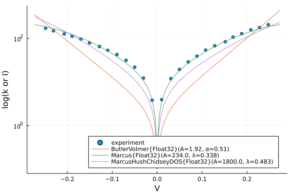
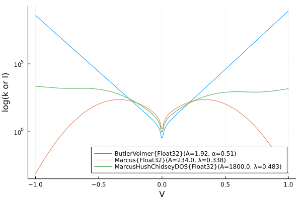

# ElectrochemicalKinetics.jl

This package implements a variety of models for rates of electrochemical reactions. The goal is to have a generic interface where different model types can be easily swapped in.

## Usage/Examples
### Building and Evaluating Models
We can construct a simple Butler-Volmer model with symmetric electron transfer as follows:
```julia
julia> bv = ButlerVolmer()
ButlerVolmer(A=1.0, α=0.5)
```
To evaluate the model and find the reaction rate at a given voltage is as simple as:
```julia
julia> bv(0.1)
6.865409234059785
```
(note that this is equivalent to `rate_constant(0.1, bv)`, but this "callable" syntax is often convenient)

By default, this computes the net reaction rate. We can also get the rate only in the oxidative direction by passing the `ox` flag:
```julia
julia> bv(0.1, true)
7.0081012366762145
```
Let's try a fancier model now. The `MarcusHushChidseyDOS` model requires information about the density of states of the electrode, which we can read from a file:
```julia
julia> mhcd = MarcusHushChidseyDOS(20, 0.2, "data/DOSes/Cu_111_dos.txt")
MarcusHushChidseyDOS(A=20.0, λ=0.2)
```
In this case, since `MarcusHushChidseyDOS<:IntegralModel`, we can't directly evaluate the object as a callable because it's ambiguous if we want the integrand or the full integrated rate constant, and we must specify:
```julia
julia> rate_constant(0.1, mhcd)
3.426690873746331
```
By default, the integration bounds are chosen to be the energy bounds over which the DOS is defined, which we can easily check:
```julia
julia> mhcd.dos
DOSData: avg value 6.7 from energy -8.6 to 18.0
```
The `DOSData` struct stores information about the DOS constructed from file. In particular, it houses an interpolation function that is used in the quadrature when evaluating the integral to compute the rate constant.

Another feature we support for `MarcusHushChidseyDOS` models is incorporating the effects of quantum capacitance. In this case, we simply need to pass a few more arguments...

```julia
julia> mhcd = MarcusHushChidseyDOS(0.82, "data/DOSes/bernal_graphene.txt")
MarcusHushChidseyDOS(A=1.0, λ=0.82)

julia> rate_constant(0.15, mhcd, true; calc_cq=true, Vq_min=-0.3, Vq_max=0.3, E_min = -0.6, E_max=0.6)
2.8017566534572208e-5
```

### Fitting and Comparing Models
The package also supports fitting model parameters to experimental data. This is where the generic syntax and the magic of Julia multiple dispatch really shine! Let's say we want to try fitting a few different types of models to some experimental data...the following script is enough to do it:
```julia
# load in some dependency packages
using DelimitedFiles
using Statistics
using ElectrochemicalKinetics

# Source the data...feel free to try other options included in the `data/` folder of the repo!
dosfile = joinpath("data", "DOSes", "Cu_111_dos.txt")
expfile = joinpath("data", "exp_data", "ecdec.txt")
exp_data = readdlm(expfile, ',')

# set the types of models to fit
model_types = [ButlerVolmer, Marcus, MarcusHushChidseyDOS]

# this is all it takes to fit the models!
models = [fit_model(exp_data, model_type; dos_file=dosfile) for model_type in model_types]

# There's a convenience function to compare results
plot_exp_and_models(exp_data, models)
```
The resulting plot looks like:


But we might also want to see the higher-voltage behavior and compare the models absent the experimental data. There's another function for that (by default it plots to +/- 1V)...
```julia
julia> plot_models(models)
```


### Electrochemical Phase Diagrams
For more on this, see upcoming paper: [arxiv link placeholder]

## Supported Models
### Butler-Volmer
Probably the most basic (and largely empirical) kinetic model. The rate constants are given by:

$$k_{\text{ox}}^{\text{BV}}(\eta)=A\exp\left(\frac{\alpha\eta}{k_{\text B}T}\right)\\k_{\text{red}}^{\text{BV}}(\eta)=A\exp\left(\frac{(1-\alpha)\eta}{k_{\text B}T}\right)$$

It is implemented in the package as `ButlerVolmer`, possessing two fields: the prefactor `A` and the transfer coefficient `α`.

### Marcus
One step up with a bit of mechanism...

$$k_{\text{red/ox}}^{\text{Marcus}}(\eta) = A\exp\left(-\frac{(\lambda\pm\eta)^2}{4k_{\text B}T}\right)$$

Implemented in the package as `Marcus`, with parameters for prefactor `A` and reorganization energy `λ`.

### Marcus-Hush-Chidsey
Originated from [Chidsey's 1991 paper](https://dx.doi.org/10.1126/science.251.4996.919).

$$k_{\text{red/ox}}^{\text{MHC}}(\eta) = A\int_{-\infty}^\infty \exp\left(-\frac{(\varepsilon-\lambda\mp\eta)^2}{4k_{\text B}T}\right)f_{\text{FD}}(\varepsilon, T)\mathrm d\varepsilon$$

Implemented as `MarcusHushChidsey`, with prefactor `A`, reorganization energy `λ`, and also an `average_dos` parameter (which defaults to 1.0), which is useful for making direct comparisons against `MarcusHushChidseyDOS` (see below).

### Asymptotic Marcus-Hush-Chidsey
Originated from [Zeng et al. 2014](https://dx.doi.org/10.1016/j.jelechem.2014.09.038d) (equation 17). We have corrected it to recover the correct temperature scaling, [paper link placeholder]

Implemented as `AsymptoticMarcusHushChidsey` with parameters `A` and `λ`.

### Marcus-Hush-Chidsey + DOS
Originated from [Kurchin and Viswanathan 2020](https://dx.doi.org/10.1063/5.0023611 ).

$$k_{\text{ox}}^{\text{MHCKV}}(\eta)=A\int_{-\infty}^\infty\mathcal{D}(\varepsilon)\exp\left(-\frac{(\lambda-\eta+\varepsilon)^2}{4\lambda k_{\text{B}}T}\right)(1-f_{\text{FD}}(\varepsilon,T))\mathrm{d}\varepsilon\\
k_{\text{red}}^{\text{MHCKV}}(\eta)=A\int_{-\infty}^\infty\mathcal{D}(\varepsilon)\exp\left(-\frac{(\lambda+\eta-\varepsilon)^2}{4\lambda k_{\text{B}}T}\right)f_{\text{FD}}(\varepsilon,T)\mathrm{d}\varepsilon$$


Implemented as `MarcusHushChidseyDOS`, with parameters `A`, `λ`, and `dos`, which must be a `DOSData` object (can be automatically constructed from a two-column text file of energies and DOS values).

## Contributing
We are happy to take pull requests for new features, new models, etc. by pull request! It is suggested (though not required) that you first open an issue to discuss.
